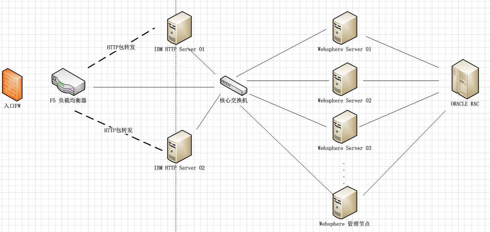
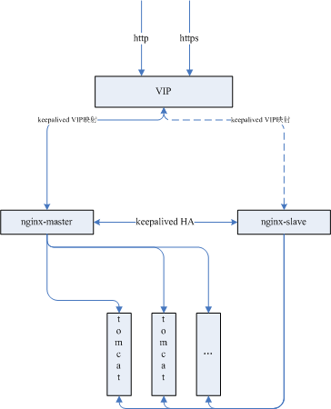

**前言：自己做的总结，结合各类摘要，对某些技术、服务等名词字眼不做过深讨论，如有错误请及时指出。**

---
## 什么是负载均衡？
讲到负载均衡是什么，首先要讨论下负载均衡出现的背景。

虽说是计算机名词，处处都源于生活嘛，生活的一部分。

* 一个人做事慢，分给多个人平坦做事。
* CPU的发展单核心高频->多核心多线程技术
* 单体架构->集群架构->分布式架构
---
## 关键字：
* 效率提升
* 横向扩容（集群）
* 平衡、防止单体过载
* 空间换时间
---
## 概念：
[负载均衡（Load balancing ）](https://en.wikipedia.org/wiki/Load_balancing_(computing))：在计算中，负载平衡改善了跨多个计算资源（例如计算机，计算机集群，网络链接，中央处理单元或磁盘驱动器）的工作负载分布。负载平衡旨在优化资源使用，最大化吞吐量，最小化响应时间，并避免任何单个资源的过载。使用具有负载平衡而不是单个组件的多个组件可以通过冗余提高可靠性和可用性。负载平衡通常涉及专用软件或硬件，例如多层交换机或域名系统服务器进程。

将负载（工作任务）进行平衡、分摊到多个操作单元上进行执行。需要我们注意的是：它并不属于网络基础架构，而是属于一种网络优化设备。它是建立在现有的网络基础架构之上，给企业提供了更廉价更有效的扩展选择。

个人总结：将负载进行平衡，将特定的业务(网络服务、网络流量等)分担给多个服务器或网络设备。

---
## 为了解决的问题：
流量堵塞、效率缓慢、运行不畅，提高业务的处理能力，服务的高可用性。

---
# 硬件负载均衡&软件负载均衡
硬件负载均衡不做讨论。列举一些产品：
* F5 BIG-IP负载均衡器（LTM）
* 思科
* Radware的AppDirector系列
* ...
---
## 网络七层协议
1. 物理层 
2. 数据链路层
3. 网络层
4. **传输层**
5. 会话层
6. 表示层
7. **应用层**
---
## 负载均衡的场景
### 浏览器发送请求后发生了什么？
* DNS服务器，DNS本身是一个基于UDP协议的网络协议，查询IP地址信息。
* 浏览器获得真正的IP、port、通过TCP协议发起网络访问
* Web Server（协议处理、静态文件、动态内容）
* 调用不同服务、不同接口等进行处理
* 响应

### 全局负载均衡系统（GSLB）
全局负载均衡主要用于在多个区域拥有自己服务器的站点，为了使全球用户只以一个IP地址或域名就能访问到离自己最近的服务器，从而获得最快的访问速度。
* 内容分发网络（CDN）
* DNS轮询
* HTTP重定向

### 服务器负载均衡系统（SLB）
* FW-F5-IHS-核心（三层）交换机-WAS
* 
* VIP-Nginx-Keepalived-webserver
* 

### 服务底层负载均衡
* 分布系统中服务的负载均衡
---
## 网络分层中的负载均衡区别
服务器负载均衡根据LB设备处理到的报文层次，分为四层服务器负载均衡和七层负载均衡。

四层处理到IP包的IP头，不解析报文四层以上载荷(L4 SLB);

七层处理到报文载荷部分，比如HTTP，RTSP，SIP报文头，有时也包括报文内容部分(L7 SLB)。

即:四层是IP:PORT的负载均衡，七层是对内容的负载均衡。

---
## 正向代理&反向代理
* 正向代理（forward proxy） ，一个位于客户端和原始服务器之间的服务器，为了从原始服务器取得内容，客户端向代理发送一个请求并制定目标（原始服务器），然后代理向原始服务器转发请求并将获得的内容返回给客户端，客户端才能使用正向代理。我们平时说的代理就是指正向代理。 简单一点：A向C借钱，由于一些情况不能直接向C借钱，于是A想了一个办法，他让B去向C借钱，这样B就代替A向C借钱，A就得到了C的钱，C并不知道A的存在，B就充当了A的代理人的角色。 

* 反向代理（Reverse Proxy），以代理服务器来接受internet上的连接请求，然后将请求转发给内部网络上的服务器，并将从服务器上得到的结果返回给internet上请求的客户端，此时代理服务器对外表现为一个反向代理服务器。理解起来有些抽象，可以这么说：A向B借钱，B没有拿自己的钱，而是悄悄地向C借钱，拿到钱之后再交给A,A以为是B的钱，他并不知道C的存在。 
---
## 服务端负载均衡&客户端负载均衡
---
## 负载均衡服务
* 四层：F5、LVS
* 七层：Nginx、HAproxy
* 协调：Keepalived
---
## 负载均衡云服务
* 阿里SLB
* Amazon ELB
* Citrix ADC
* 腾讯 CLB
* Radware的AppDirector
---
## 负载均衡组件
* zookeeper
* spring-cloud-ribbon客户端负载均衡
* spring-cloud-zuul实现反向代理和负载均衡
---
## 负载均衡策咯
* 轮询
* 权重轮询
* 最少连接数
* 权重最少连接数
---
## 参考资料
* Load Balancing (computing) WIKI：https://en.wikipedia.org/wiki/Load_balancing_(computing)
* 四层/七层负载均衡区别：https://www.jianshu.com/p/fa937b8e6712
* 软/硬件负载均衡产品知多少：https://www.cnblogs.com/lcword/p/5773296.html
* 全局负载均衡与CDN网络简介：https://blog.csdn.net/u010340143/article/details/9062213
* 大型网络-负载均衡架构：http://www.cnblogs.com/and/p/3366400.html
* Nginx实现负载均衡+keepalived实现Nginx高可用：https://www.cnblogs.com/youzhibing/p/7327342.html
* 正向代理&反向代理：https://blog.csdn.net/zt15732625878/article/details/78941268
